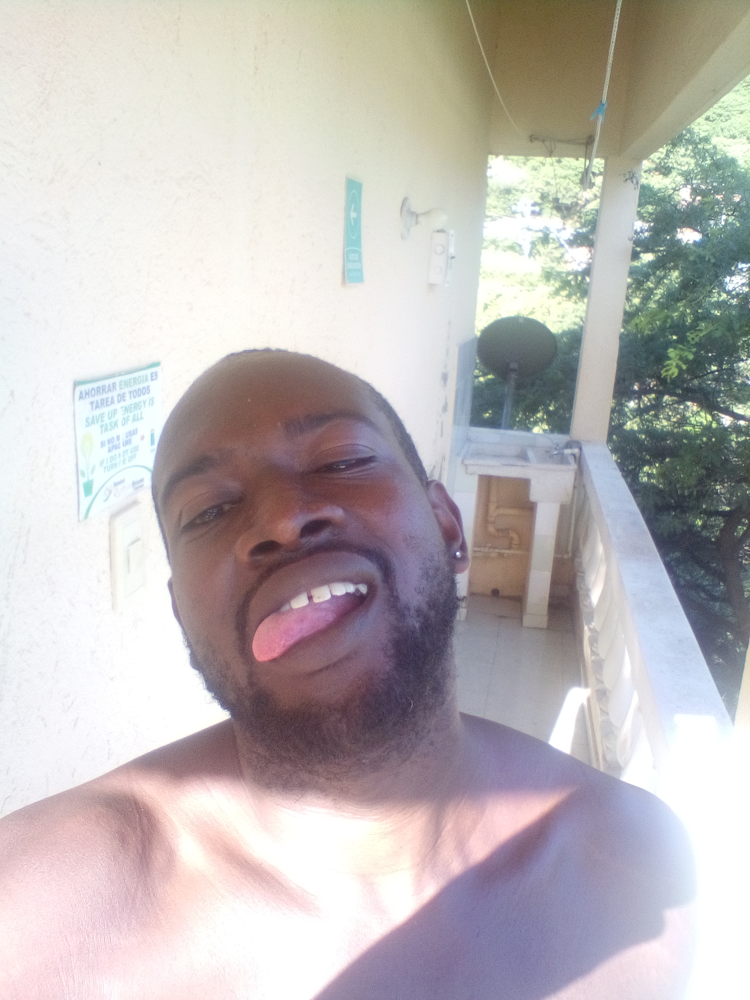

# version-2-after-go-live-stronger-copy-edits

## Mateo M. 37

## English (Original)

Fuck what you were planning to do tonight.

come hang out with me in taganga instead.

Nothing of stress. Nothing of seriousness.

Only pure fun.

and a good time between two new friends. with rights.

## Spanish (Google Translated)

A la mierda lo que planeabas hacer esta noche.

ven a pasar el rato conmigo en taganga en su lugar.

Nada de estrés. Nada de seriedad.

Sólo pura diversión.

y un buen rato entre dos nuevos amigos. con derechos.

## Profile Copywriting Commentary // Directory's Cut

Much much stronger copy.

Getting their fucking attention off the gate.

I went much stronger and much more direct.

But i went more directly indirect.

I have no problem going "mode zero", but tinder in colombia does not appear to be the place for that.

Though I have done it, and it works.

i'm really trying to stress key bits here and using the amigos con derechos.

in my city at least (don't know other areas), `amigos con derechos` is how you are `fuck buddy` in spanish.
